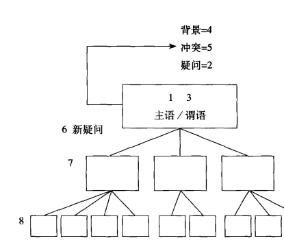

==========================================
如何构建金字塔
==========================================

自上而下法
==========================================

1. 你准备讨论的主题
2. 你准备回答的疑问
3. 回答读者的疑问
4. 列出背景
5. 列出冲突
6. 以上答案是否有引发新的疑问
7. 确定试用演绎或者归纳
8. 重复上面步骤

详细步骤如下

画出主题方框
    这个是金字塔最顶部的方框，方框中需要填入需要讨论的主题。
确定主要疑问
    确定文章的读者，你的文章面向哪些对象，你希望文章能回答读者头脑哪些疑问。
写出对该疑问的回答
    如果知道就写出来你的回答
说明背景
    把要讨论的主题和背景相结合，作出第一个关于该主题的不会引起争议的表述。
指出冲突
    说明背景中发生了男鞋冲突，以致引发读者的疑问。
检查主要疑问和答案
    对背景中冲突的介绍，应当直接引导读者提出主要疑问。

自下而上法
==========================================
很多时候我们自己都没有想清楚金字塔的顶部的，也就是无法确定主题，疑问等。可以尝试通过三步走的自下而上地组织你的思想。

1. 列出你想表达的所有思想要点
2. 列出各要点之间的逻辑关系
3. 得出结论

初学者注意事项
==========================================

1. 要先尝试自上而下法
2. 序言先写背景，将背景作为序言的起点。
3. 多花点时间思考序言，不要省略这一步。
4. 将背景放在序言中。
5. 序言仅涉及读者不会对其真实性提出质疑的内容。
6. 在关键句层次上，更宜选择归纳法而非演绎法。

